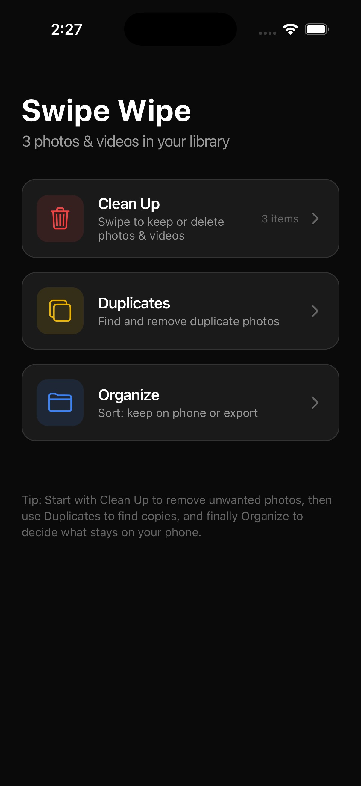
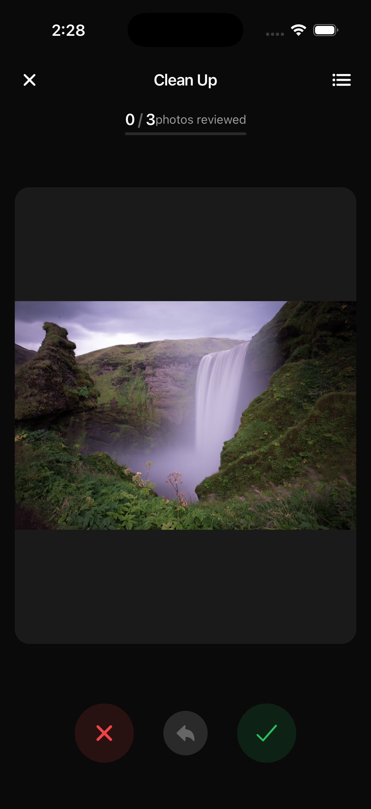
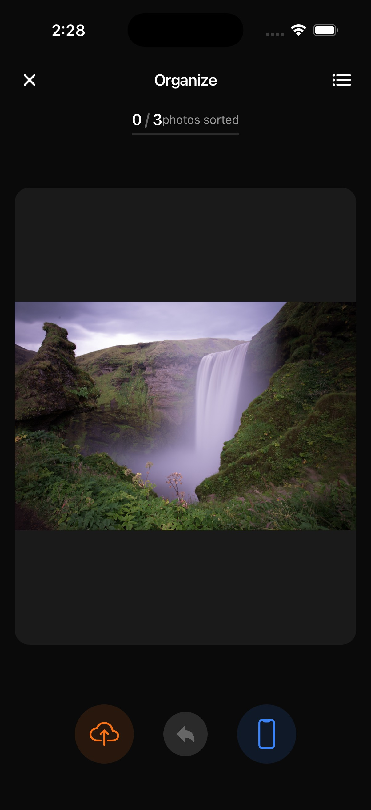
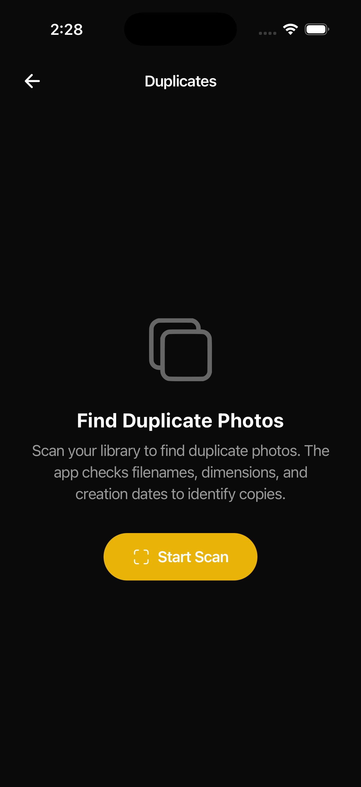

# Swipe Wipe

A personal photo & video management app built with React Native and Expo. Tinder-style swiping to quickly triage your camera roll — keep what matters, delete what doesn't.

<p align="center">
  
  
  
</p>

## Features

### Clean Up
Swipe through every photo and video in your library. Swipe right to keep, swipe left to mark for deletion. Review your choices before anything is permanently removed.

### Duplicates
Scan your library for duplicate photos by matching filenames, dimensions, and creation dates. Select which copies to remove in a single batch.

<p align="center">
  
</p>

### Organize
After cleanup, sort the photos you kept into two buckets:
- **Keep on Phone** — photos you need on-device
- **Export to Hard Drive** — photos moved to a "To Export" album in Apple Photos for manual transfer via USB/Finder

### Video Playback
Videos are fully playable inline with native iOS controls — play/pause, scrubber, and audio — so you can preview before deciding.

### Session Persistence
Quit mid-session and pick up exactly where you left off. The app saves your progress (swipe decisions, current position, mode) and prompts you to resume or start fresh.

### Undo Everything
Every swipe action can be undone. Nothing is deleted until you explicitly confirm on the review screen.

## Tech Stack

| Layer | Technology |
|-------|-----------|
| Framework | [Expo SDK 54](https://expo.dev) / React Native 0.81 |
| Navigation | [expo-router](https://docs.expo.dev/router/introduction/) (file-based) |
| Media Access | [expo-media-library](https://docs.expo.dev/versions/latest/sdk/media-library/) |
| Video | [expo-video](https://docs.expo.dev/versions/latest/sdk/video/) |
| Images | [expo-image](https://docs.expo.dev/versions/latest/sdk/image/) |
| Haptics | [expo-haptics](https://docs.expo.dev/versions/latest/sdk/haptics/) |
| Persistence | [@react-native-async-storage/async-storage](https://github.com/react-native-async-storage/async-storage) |
| Gestures | React Native `PanResponder` + `Animated` |
| Theme | Custom dark theme |

## Getting Started

### Prerequisites
- Node.js 18+
- [Expo Go](https://expo.dev/go) installed on your iPhone (or iOS Simulator)

### Install & Run

```bash
git clone https://github.com/parthkumar-patel/swipe-wipe.git
cd swipe-wipe
npm install
npx expo start --ios
```

Scan the QR code with Expo Go on your phone, or press `i` to open in the iOS Simulator.

### Permissions
The app requires **full photo library access** to read, delete, and organize your media. You'll be prompted on first launch.

## Project Structure

```
swipe-wipe/
├── app/                    # Screens (expo-router file-based routing)
│   ├── _layout.tsx         # Root layout with PhotoProvider
│   ├── index.tsx           # Home screen
│   ├── swipe.tsx           # Swipe interface (cleanup & organize modes)
│   ├── review.tsx          # Review & confirm deletions/exports
│   └── duplicates.tsx      # Duplicate scanner
├── components/             # Reusable UI components
│   ├── SwipeCard.tsx       # Animated swipeable card
│   ├── VideoPlayer.tsx     # Video playback with native controls
│   ├── FeatureCard.tsx     # Home screen feature cards
│   ├── PhotoGrid.tsx       # Selectable photo grid
│   └── ProgressBar.tsx     # Session progress indicator
├── context/
│   └── PhotoContext.tsx     # Global state (useReducer + AsyncStorage)
├── hooks/
│   └── useDuplicateScanner.ts
├── constants/
│   └── theme.ts            # Dark theme tokens
└── assets/
    └── screenshots/
```

## How It Works

1. **Clean Up** — Swipe through your entire library. Right = keep, left = delete. Tap the review button to see your choices, move items between lists, then confirm deletion.
2. **Duplicates** — Tap "Start Scan" to find duplicate photos. The scanner groups by metadata (filename, dimensions, creation date). Select duplicates to remove and delete in one batch.
3. **Organize** — After cleanup, swipe again to sort kept photos. Right = keep on phone, left = export. "Export" photos are added to a "To Export" album in Apple Photos for manual USB transfer.

## License

Personal use project. Not intended for distribution.
